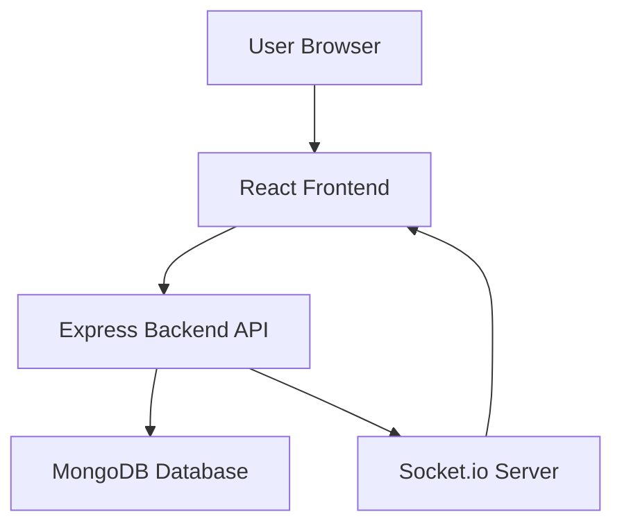
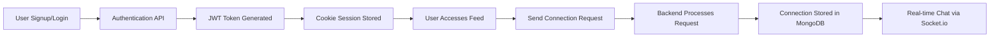
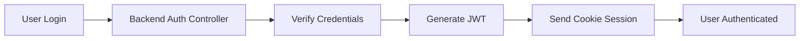
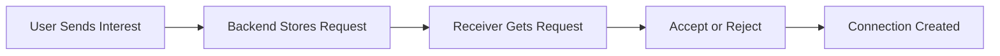
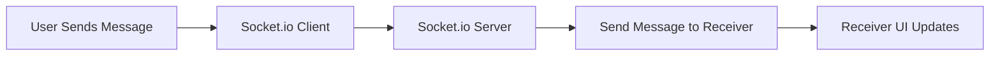
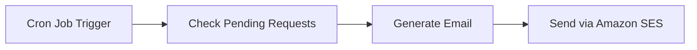
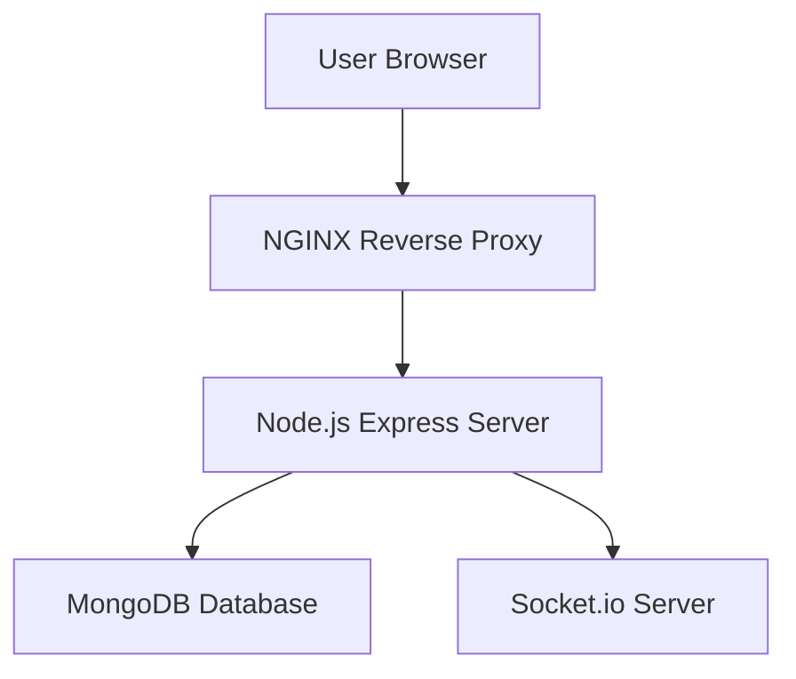

# DevMatch – Developer Matchmaking Platform

🌐 **Live Demo**
https://devmatch.shop

DevMatch is a **real-time developer matchmaking platform** that helps developers discover, connect, and collaborate with like-minded developers.

The platform provides features like **profile discovery, connection requests, real-time chat, and email reminders**, enabling developers to network and collaborate efficiently.

The system is built using a **full-stack architecture with React, Node.js, MongoDB, and Socket.io**, and deployed on **AWS EC2 with NGINX and PM2 for production stability**


---


---


---


---


---

# Project Architecture

DevMatch follows a **modern full-stack client–server architecture**.



### Architecture Responsibilities

**Frontend**

* UI rendering
* Feed interaction
* Chat interface
* API communication
* State management

**Backend**

* Authentication & sessions
* Matchmaking algorithm
* Connection management
* Real-time communication
* Email notifications

---

# System Workflow



---

# Tech Stack

## Frontend

* React 19
* Redux Toolkit
* React Router
* Axios
* Tailwind CSS
* DaisyUI
* Framer Motion
* Socket.io Client

---

## Backend

* Node.js
* Express.js
* MongoDB
* Mongoose
* JWT Authentication
* Socket.io
* Amazon SES
* Node Cron
* Validator
* Bcrypt

---

## Deployment & Infrastructure

* AWS EC2
* NGINX Reverse Proxy
* PM2 Process Manager

---

# Key Features

# 1. Authentication System

DevMatch implements **JWT-based authentication with cookie sessions**.

### Features

* Secure login/signup
* Password hashing with bcrypt
* JWT token generation
* Cookie-based authentication
* Protected routes

### Workflow



---

# 2. Developer Matchmaking Feed

The platform provides a **Tinder-like feed system** where users can discover other developers.

### Feed Algorithm

The `/feed` API returns developers that:

* Are not already connected
* Have not been ignored
* Are not the current user

### User Actions

* **Interested**
* **Ignore**

These actions determine future matchmaking suggestions.

---

# 3. Connection Request System

Users can send and manage connection requests.

### Connection States

* Interested
* Ignored
* Accepted
* Rejected

### Workflow



---

# 4. Real-Time Chat System

DevMatch supports **real-time messaging between connected users**.

### Technology

Socket.io

### Features

* Instant message delivery
* Persistent chat history
* WebSocket communication
* Real-time updates

### Workflow



---

# 5. Email Reminder System

DevMatch sends **email notifications for pending connection requests**.

### Technology

Amazon SES

### Implementation

* Cron job checks pending requests
* Sends reminder emails to users

### Workflow



---

# Frontend Architecture

Directory structure:

```
src
├ components
├ pages
├ redux
├ hooks
├ services
├ utils
├ App.jsx
└ main.jsx
```

### Explanation

**components**

Reusable UI components such as:

* Navbar
* Developer Card
* Chat Window
* Connection Requests

**pages**

Main application pages:

* Login
* Signup
* Feed
* Profile
* Chat

**redux**

State management using **Redux Toolkit**.

**services**

API request logic using **Axios**.

---

# Backend Architecture

Backend follows a **modular MVC architecture**.

```
src
├ controllers
├ routes
├ models
├ middleware
├ utils
├ app.js
└ server.js
```

### Explanation

**controllers**

Handle business logic such as:

* Authentication
* Feed generation
* Connection requests

**routes**

Define API endpoints and map them to controllers.

**models**

Mongoose schemas such as:

* User
* Connection
* Chat

**middleware**

Authentication and validation middleware.

---

# API Endpoints

## Authentication

```
POST /signup
POST /login
POST /logout
```

---

## User Profile

```
GET /profile
PATCH /profile/edit
```

---

## Developer Feed

```
GET /feed
```

Returns developers available for matchmaking.

---

## Connection Requests

```
POST /request/interested/:userId
POST /request/ignore/:userId
POST /request/review/:status/:requestId
```

---

## Chat System

```
Socket.io WebSocket connection
```

Handles real-time messaging between connected users.

---

# Environment Variables

```
PORT=5000
MONGO_URI=your-mongodb-uri
JWT_SECRET=your-secret
AWS_ACCESS_KEY=your-key
AWS_SECRET_KEY=your-secret
AWS_REGION=your-region
SES_EMAIL=your-email
```

---

# Installation

## Clone Repository

```
git clone https://github.com/Abhishekkumar175/DevLinker.git
```

---

## Backend Setup

```
cd DevLinker
npm install
npm run dev
```

---

## Frontend Setup

```
cd devmatch-web
npm install
npm run dev
```

---

# Deployment

DevMatch is deployed using **AWS EC2**.

### Deployment Architecture



### Deployment Tools

* **AWS EC2** – Application hosting
* **NGINX** – Reverse proxy and SSL routing
* **PM2** – Process manager for Node.js

---

# Security Features

* JWT authentication
* Password hashing (bcrypt)
* Cookie-based sessions
* Input validation
* Protected routes
* Secure API handling

---

# Future Improvements

Possible enhancements:

* AI-based developer matching
* Group chat functionality
* Skill-based search filters
* Developer recommendation system
* Push notifications
* Mobile application

---

# Author

**Abhishek Kumar**
MERN Stack Developer

GitHub
https://github.com/Abhishekkumar175

LinkedIn
https://www.linkedin.com/in/345abhishek-kumar/

---

# License

This project is **open-source and available for learning and educational purposes**.


